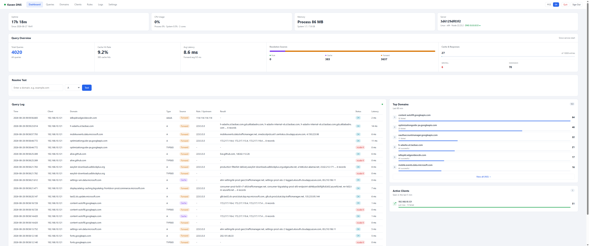

# kaven-dns

A DNS server built on Node.js with a Web console for monitoring and management.



## Features

- **Standard DNS service**: listens on both UDP and TCP; supports A / AAAA / CNAME and passes common record types through
- **Dynamic resolution rules** (add / edit / delete take effect immediately, no restart):
  - `Fixed answer`: return a specified IP (or several) or a CNAME target directly
  - `Forward`: forward the query to a third-party DNS (a per-rule upstream can be set, e.g. `8.8.8.8`); queries that match no rule go to the default upstream group
  - **Domain groups**: one rule holds multiple domains (one per line in the editor, up to 500); they share the same configuration, and editing the rule applies to the whole group at once
- **Answer caching**: forwarded answers are cached by their minimum TTL (bounds configurable), with LRU eviction, hit-rate stats and one-click flush
- **Upstream racing**: default upstreams are queried in parallel and the fastest successful response wins; TC-flagged answers are automatically retried over TCP
- **Bilingual Web console** (Chinese / English, simple password authentication):
  - Language switcher on the login page and in the header; the preference is remembered and auto-detected from the browser on first visit
  - Dashboard: at-a-glance overview — query volume, rule/cache/forward hits, failures, average latency, cache hit rate, a top-6 preview of top domains / active clients, and the 20 most recent log entries; server cards for uptime, process/system CPU usage, memory (process RSS + system), and host info (hostname, OS, arch, Node version)
  - Query Log tab: a 60-minute query/latency/failure trend chart, plus the complete live query log as a sortable table (click any column header) with a domain search box, a time-range selector (last 15m/1h/6h/24h/7d, or a custom from/to range), and column-header filter popovers (funnel icon → pick a value → Reset/Confirm) on Domain, Client, Type, Source, Rule/Upstream and Status (OK or failed)
  - Domains tab / Clients tab: the complete top-domains and active-clients rankings as sortable, searchable tables with the same column-header filter popover on Failures (all / has failures / no failures), each on its own page (not capped to the Dashboard's top-6 preview)
  - Authenticated SSE streams batched live updates to visible consoles, with automatic reconnect and periodic REST fallback; analytics use the retained query window, which survives a normal restart (saved on clean shutdown, restored on the next start) and is only lost on a crash
  - Rules management: table + modal editor, enable toggle, remarks, import/export as JSON (merge by domains+type, or replace all)
  - Settings: upstream list, cache and log parameters, ports, password change, cache flush, resolve test
  - System Logs: operation/config-change audit trail plus the console output (what a hidden terminal would have shown), with a dark console viewer
  - API error messages are localized too, negotiated from the `Accept-Language` header
- **No database**: rules, config and the query log persist to `data/*.json` (atomic writes, restored on the next start after a normal exit/restart)

## Quick Start

```bash
pnpm install
pnpm start
```

On first run the console opens a **setup screen** where you set the admin password, the DNS/Web ports and the DNS bind address; then sign in with the password you chose.

> Listening on port 53 requires administrator privileges:
> - Windows: run the terminal as administrator; or start with a debug port first: `KAVEN_DNS_PORT=5330 pnpm start`
> - After allowing UDP/TCP 53 through the firewall, LAN devices can point their DNS at this machine

## Usage

Once setup is complete, the server is already answering queries with the default upstream group — the steps below cover pointing real devices at it and shaping how it resolves:

- **Sign in** to the Web console at `http://<host>:<webPort>` (default port `8080`) with the admin password you set during setup.
- **Add rules** on the Rules page for any domain you want to control: `Fixed answer` for internal hostnames or blocking, `Forward` to send specific domains to a different upstream. Rules take effect immediately, no restart needed — see [Rule Matching](#rule-matching) for how patterns and priority work.
- **Everything unmatched** falls through to the default upstream group (see [Configuration](#configuration)) with caching and upstream racing applied automatically.
- **Verify and monitor**: use the Settings page's resolve test, an external tool such as `nslookup` (see [Verification](#verification) below), or watch live traffic on the Dashboard, Query Log, Domains and Clients tabs.

### Configure your system to use it

Point a device's DNS at this machine's LAN IP (not `127.0.0.1`, which only resolves for processes on the same machine) on port `53` — most OS/router DNS settings don't support a custom port, so if you're running on a debug port such as `5330`, only tools that let you specify a port (e.g. `nslookup`, the Settings page's resolve test) can reach it.

- **Windows**: Settings → Network & Internet → your connection → "Edit" next to DNS server assignment → Manual → On → set Preferred DNS to the server's LAN IP → Save.
- **macOS**: System Settings → Network → your connection → Details → DNS → add the server's LAN IP under DNS Servers (place it above any other entries).
- **Linux (NetworkManager)**: `nmcli con mod <connection-name> ipv4.dns <ip>` then `nmcli con up <connection-name>`; other setups can edit `/etc/systemd/resolved.conf` or `/etc/resolv.conf` directly.
- **Router** (recommended — applies to every device on the network): in the router's LAN/DHCP settings, set the DNS server to this machine's LAN IP. Give that machine a static/reserved IP first so devices don't lose DNS when its lease changes.
- **Android**: Wi-Fi settings → long-press the connected network → Modify network → Advanced options → IP settings: Static → set DNS 1 to the server's LAN IP.
- **iOS**: Settings → Wi-Fi → ⓘ next to the connected network → Configure DNS → Manual → add the server's LAN IP.

## Verification

```bash
# Forwarded resolution (the second query hits the cache; the source column
# in the dashboard log changes accordingly)
nslookup baidu.com 127.0.0.1

# After adding a fixed rule test.local -> 1.2.3.4 on the Rules page:
nslookup test.local 127.0.0.1
```

## Deployment

### Docker

Prebuilt multi-architecture images (`linux/amd64` and `linux/arm64`) are published to Docker Hub and the GitHub Container Registry:

- `kavenzero/kaven-dns`
- `ghcr.io/kaven-universe/kaven-dns`

Run the latest image with DNS on port 53 and the Web console on port 8080:

```bash
docker run -d \
  --name kaven-dns \
  --restart unless-stopped \
  --cap-add NET_BIND_SERVICE \
  -p 53:53/tcp \
  -p 53:53/udp \
  -p 8080:8080 \
  -v kaven-dns-data:/app/data \
  kavenzero/kaven-dns:latest
```

Open `http://localhost:8080` to complete the first-run setup. The named volume preserves configuration, rules, sessions, and the query log across container upgrades (`docker stop`/recreate sends `SIGTERM`, which the image's `dumb-init` entrypoint forwards to the Node process so it can save its state before exiting; `docker kill` skips this and loses unsaved history, same as any other unclean termination).

The container runs as a non-root user. If you do not want to grant permission to bind port 53, run DNS on an unprivileged port instead:

```bash
docker run -d \
  --name kaven-dns \
  --restart unless-stopped \
  -e KAVEN_DNS_PORT=5330 \
  -p 5330:5330/tcp \
  -p 5330:5330/udp \
  -p 8080:8080 \
  -v kaven-dns-data:/app/data \
  kavenzero/kaven-dns:latest
```

Select DNS port `5330` in the first-run setup screen as well. The environment variable applies the startup override, while the setup selection is saved in the persistent configuration.

To build the image locally:

```bash
docker build -t kaven-dns .
```

The publishing workflow runs on manual dispatch (Actions tab). Images receive branch/tag, commit SHA, current date-time, and `latest` tags as applicable.

## Rule Matching

A rule holds a group of domain patterns; a query matches the rule when it matches any pattern in the group. The table below is per pattern:

| Pattern | Matches |
|---|---|
| `example.com` | itself and all subdomains (dnsmasq style) |
| `*.example.com` | subdomains only, not itself |

- Priority: patterns with more labels (longer suffix) win; among equal label counts, plain patterns beat wildcards. When different rules tie on specificity, the newer rule wins — so an override added after a group rule takes effect.
- Record types must match the query type; CNAME rules are the exception — an A/AAAA query returns the CNAME plus the target's resolved records
- Legacy rules persisted with a single `domain` field are migrated to the `domains` array automatically on startup

## Configuration

`data/config.json` (editable on the Settings page):

| Field | Default | Description |
|---|---|---|
| `dnsPort` | 53 | DNS listen port (UDP+TCP); changes apply immediately after saving |
| `bindAddress` | 0.0.0.0 | DNS listen address; e.g. `127.0.0.1` for local only (coexists with the Windows ICS service that holds `0.0.0.0:53`) |
| `webPort` | 8080 | Web console port; changes apply immediately after saving |
| `webBindAddress` | 0.0.0.0 | Web console bind address; e.g. `127.0.0.1` for local-only, or a LAN IP to serve the console on that interface |
| `upstreams` | `223.5.5.5, 119.29.29.29, 114.114.114.114` | Default upstream group (`ip` or `ip:port`) |
| `forwardTimeoutMs` | 3000 | Timeout per upstream forward |
| `ttlMin` / `ttlMax` | 10 / 3600 | Cache TTL clamp range (seconds) |
| `logRetentionDays` | 7 | Days of query log history to retain; 0 disables time-based trimming. Entries are also trimmed automatically (oldest first) if the system is low on free memory or this process's own memory usage grows large, so the log can hold as much history as available memory allows rather than a small fixed count |
| `sessionTtlHours` | 24 | Web console session validity in hours; renewed on activity (idle timeout) and persisted across restarts |

Environment variables: `KAVEN_DNS_PORT` / `KAVEN_WEB_PORT` temporarily override the ports (useful for debugging); `KAVEN_DATA_DIR` relocates the data directory (defaults to `<repo>/data`).

## REST API Summary

Everything except the setup endpoints and login requires `Authorization: Bearer <token>`.
Error messages are localized when an `Accept-Language: zh` (or `en`) header is sent.

| Method | Path | Description |
|---|---|---|
| GET | `/api/setup/status` | Check whether first-run setup is required; returns local IPv4 addresses |
| POST | `/api/setup/check` | Check whether the selected DNS port and address are available |
| POST | `/api/setup` | Complete first-run setup with password, ports and bind addresses |
| POST | `/api/auth/login` | Sign in `{password}` → `{token}` |
| GET/POST | `/api/rules` | List / create rules |
| POST | `/api/rules/import` | Import rules `{rules, mode: merge\|replace}` |
| PUT/DELETE | `/api/rules/:id` | Update / delete |
| GET | `/api/logs?domain=&source=&status=&type=&client=&rule=&since=&until=&limit=` | Query log (`status`: `ok`\|`fail`; `since`/`until` are epoch ms) |
| GET | `/api/stats` | Stats, cache info, DNS listener status |
| GET | `/api/syslog?limit=` | Console output + audit events (operation/config changes) |
| GET | `/api/events` | Authenticated SSE stream for batched query, stats and system-log updates |
| POST | `/api/shutdown` | Stop the program |
| POST | `/api/cache/flush` | Flush the cache |
| GET/PUT | `/api/config` | Read / update config (incl. password change) |
| POST | `/api/resolve` | Resolve test `{domain, type}` |

## Project Layout

```
src/
├── index.js          # Entry point: wires everything together and starts DNS + Web
├── config.js         # Config load/persist (first-run setup wizard data)
├── i18n.js           # zh/en message dictionaries for user-facing API errors
├── system.js         # Server info + CPU/memory sampling for dashboard cards
├── dns/
│   ├── server.js     # UDP + TCP DNS server (dns2)
│   ├── resolver.js   # Resolution pipeline: rule → fixed / cache / forward
│   ├── forwarder.js  # Parallel upstream racing
│   ├── cache.js      # LRU + TTL cache
│   ├── matching.js   # Domain matching (wildcards, suffix priority)
│   └── util.js       # Type maps and summary helpers
├── store/
│   ├── rules.js      # Rule CRUD + JSON persistence (hot reload)
│   ├── logs.js       # Query log ring buffer + stats
│   └── syslog.js     # Console output capture + audit event ring buffer
└── web/
    ├── server.js     # Express REST API
    ├── events.js     # Authenticated SSE batching + slow-client recovery
    ├── auth.js       # Password login + token sessions
    └── public/       # Vue3 single-file frontend (no build step, zh/en)
        ├── index.html
        └── vendor/vue.global.prod.js   # served locally, works offline
```

## Notes

- The frontend serves Vue 3 locally (`web/public/vendor/`), so the console works in offline / intranet environments
- Login sessions are stored in `data/sessions.json` (idle timeout, renewed on activity) so server restarts keep you signed in
- The query log and its stats are saved to `data/querylog.json` on a clean shutdown (SIGINT/SIGTERM) and restored on the next start, so a normal exit/restart doesn't lose history; there is no ongoing per-query disk write, and an unclean termination (crash, `kill -9`) still loses whatever wasn't saved at the last clean shutdown
